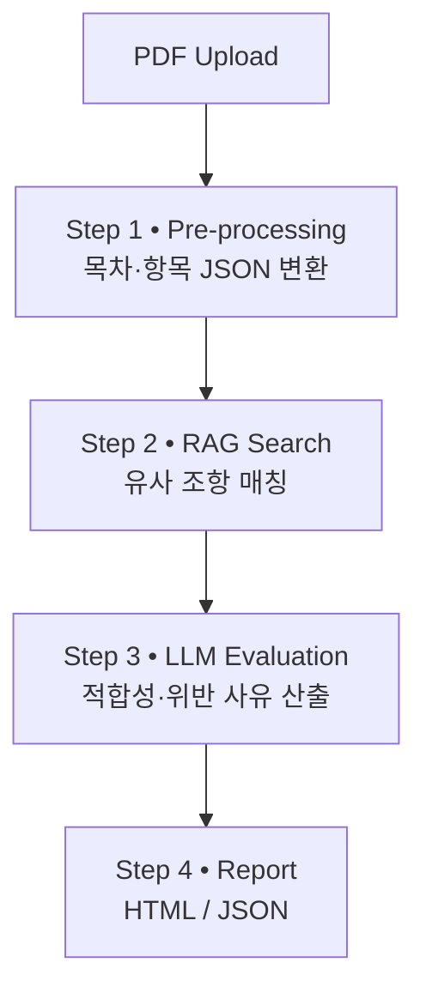

# 개인정보처리방침 AI 점검 도구 프로토타입 개발
> 개인정보처리방침을 점검하는 AI-기반 자동화 도구입니다. 기업의 처리방침 PDF만 업로드하면 RAG + LLM 조합으로 **법령 적합성**을 판단하고 보고서를 생성합니다.

---

## 1 · 프로젝트 개요
| | 내용 |
|---|---|
| **문제의식** | 수백 줄에 달하는 개인정보처리방침을 수작업으로 검토하기에는 시간이 오래 걸리고 오류가 잦음 |
| **목표** | ① 전처리 → ② 법령 RAG 검색 → ③ LLM 판단 전 과정을 자동화해 **PDF/HTML 보고서**를 즉시 출력 |
| **현재 성과** |  ▲전처리 정밀화 ▲학습데이터 확충 과제를 도출 |

---

## 2 · 핵심 기능 / 파이프라인


* **Step 1 · 전처리** : PDF → 텍스트 추출 → 목차·제목·본문을 JSON(번호·제목·내용)으로 재구성  
* **Step 2 · RAG 검색** : 항목 임베딩 → 개인정보보호법·영·고시 조항 DB에서 K-15 검색  
* **Step 3 · LLM 판단** : 「개인정보처리방침 작성지침」 기준으로 GPT-4o mini가 적합성·근거 문장 출력  
* **Step 4 · 리포트** : 항목·위반 여부·관련 법령·근거를 표 형태로 요약, HTML 저장  

---

## 3 · 데이터 정의
| 구분 · 자료명 | 주요 내용 · 용도 | 형식 |
|---|---|---|
| **입력문서**<br>평가 대상 기업 처리방침 | AI 분석 대상 원본 문서 | `PDF` |
| **벡터DB**<br>개인정보보호법 · 시행령 · 고시 | 조항 단위 임베딩 DB | `Qdrant` |
| **AI 학습문서**<br>「개인정보처리방침 작성지침」 | LLM 사전지식 · 판단 기준 | `PDF` |
| **AI 평가 입력**<br>LLM 프롬프트 | 목차별 판단 기준과 출력 포맷 | `TXT / JSON` |
| **출력데이터**<br>점검 결과 보고서 | 위법 여부 · 근거 · 개선안 | `PDF / HTML` |

---

## 4 · 기술 스택
| 영역 | 사용 기술 |
|---|---|
| **Backend** | FastAPI, Uvicorn, Pydantic |
| **AI** | GPT-4o mini (OpenAI), intfloat/multilingual-e5-large |
| **Vector DB** | Qdrant (+ mcp-server-qdrant 커스텀) |
| **Frontend / Demo** | LangGraph UI, Streamlit |
| **DevOps** | Docker Compose, GitHub Actions, Makefile |

---

## 5 · 대시보드

- 상세결과


---

## 6 · 참고 자료
- 개인정보 보호법·시행령·고시 전문  
- 「개인정보처리방침 작성지침」 (2025-04)  
- qdrant/mcp-server-qdrant GitHub 레포  

> **주의** : 본 도구는 연구·교육 목적의 프로토타입입니다. 자동 산출된 점검 결과는 법적 효력을 갖지 않으므로, 최종 검토는 전문 법무팀이 수행해야 합니다.

&nbsp;
# 🧠 Qdrant 벡터 DB 복원 가이드

이 프로젝트는 Qdrant 벡터 DB를 사용하여 사전 임베딩된 데이터를 저장합니다. 다른 컴퓨터나 환경에서도 동일한 벡터 데이터를 재사용하려면 아래 절차를 따라 복원할 수 있습니다.

---

## 📁 사전 준비

- `qdrant_backup.tar.gz` 파일이 프로젝트 루트 디렉토리에 있어야 합니다.
- Docker가 설치되어 있어야 합니다.  
  [Docker Desktop 설치 가이드](https://www.docker.com/products/docker-desktop)

---

## 🔄 복원 절차

### 1. Qdrant용 Docker 볼륨 생성

```bash
docker volume create qdrant_storage
```

### 2. 백업 데이터 복원

#### ✅ macOS / Linux

```bash
docker run --rm -v qdrant_storage:/volume -v ${PWD}:/backup alpine sh -c "tar xzf /backup/qdrant_backup.tar.gz -C /volume"
```

#### ✅ Windows PowerShell

```powershell
docker run --rm -v qdrant_storage:/volume -v "$(Get-Location):/backup" alpine sh -c "tar xzf /backup/qdrant_backup.tar.gz -C /volume"
```

---

### 3. Qdrant 컨테이너 실행

```bash
docker run -p 6333:6333 -v qdrant_storage:/qdrant/storage qdrant/qdrant
```

Qdrant 서버는 기본적으로 포트 `6333`에서 실행되며, 브라우저에서 다음 주소로 확인 가능합니다:

```
http://localhost:6333/collections
```

---

## 📌 참고 사항

- 이 백업은 `qdrant_storage`라는 Docker 볼륨명을 기준으로 만들어졌습니다. 다른 이름을 사용할 경우 명령어 내 볼륨명을 수정하세요.
- 복원된 Qdrant 인스턴스는 이전에 임베딩된 벡터들을 그대로 유지합니다. 따라서 추가 임베딩 없이 바로 검색에 사용할 수 있습니다.
- LangGraph 또는 MCP 서버와 연결 시 `collection_name`, `vector_name` 등이 기존과 일치해야 정상 작동합니다.

---

&nbsp;

# 🧠 MCP 사용 방법

### 0. Qdrant 벡터 DB 연결

-  Qdrant 벡터 DB 복원 가이드 참고.
-  환경 설정.
```bash
pip install -r requirements.txt
```

### 1. MCP 서버 로컬 실행

```bash
set QDRANT_URL=http://localhost:6333
set EMBEDDING_MODEL=intfloat/multilingual-e5-large
uvx mcp-server-qdrant --transport sse
```

### 2. LangGraph UI 실행

```bash
set PYTHONPATH=src
fastmcp dev src/mcp_server_qdrant/server.py
```

---

&nbsp;

# 🖥️ Streamlit UI 사용 방법

### 3. Streamlit UI 실행

> **사전 조건**  
> - 앞 단계(0 ~ 2)에서 Qdrant 벡터 DB + MCP 서버가 **실행 중**이어야 합니다.  
> - `requirements.txt`에 포함된 Streamlit 관련 의존성이 이미 설치돼 있어야 합니다.

```bash
# Streamlit 앱 실행
streamlit run streamlit_ui.py --server.port 8501
